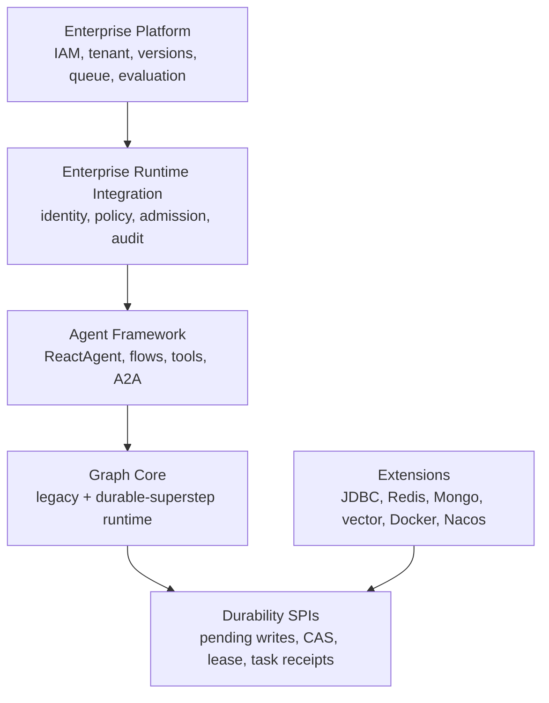

# LangGraph-Inspired Compatible Enterprise Runtime Design

Status: Approved for implementation planning on 2026-09-22.

## Objective

Evolve Agentic Spring AI from a production-capable embedded agent and graph
runtime into a runtime that can support enterprise control-plane integrations,
without breaking existing applications, stored state, or integrations.

The design borrows the durable-execution contracts that have proved useful in
LangGraph: explicit supersteps, isolated parallel writes, pending writes,
durable tasks, typed runtime context, checkpoint namespaces, deterministic
interrupt and resume semantics, and a clean boundary between the open-source
runtime and an enterprise platform.

The design does not replace the existing executor, copy LangGraph's Python API,
or move platform concerns into Graph Core. All new behavior is additive and
opt-in until it has passed compatibility, failure-injection, and rollout gates.

## Compatibility Contract

The following surfaces are compatibility invariants for the 2.x release line:

- Public and protected Java classes, packages, method signatures, constructors,
  nested types, enum constants, and documented exception contracts.
- Existing Maven artifact coordinates and Core/Extensions ownership boundaries.
- Existing `spring.ai.alibaba.*` configuration keys, defaults, and activation
  rules.
- `Agent.invoke`, `Agent.stream`, `StateGraph`, `CompiledGraph`,
  `OverAllState`, `RunnableConfig`, `BaseCheckpointSaver`, and `Store` behavior
  when no new feature is enabled.
- Existing checkpoint and Store physical formats, table names, key prefixes,
  serializer behavior, and thread lookup rules.
- Existing Studio and A2A request and response shapes.
- Existing graph execution order, state merge behavior, streaming order,
  interrupt behavior, and checkpoint timing in legacy mode.

New capabilities may be introduced through new types, new overloads, default
methods with behavior equivalent to the old contract, independent capability
interfaces, optional sidecar storage, and opt-in configuration. A deprecated
public API remains available for at least two minor releases and is removed only
in a major release.

## Goals

1. Make run identity, deadline, budget, cancellation, and execution policy
   explicit and strongly typed.
2. Define an opt-in durable-superstep execution contract for deterministic
   parallel state visibility and recovery.
3. Preserve successful parallel work when another branch fails.
4. Provide a durable boundary for external side effects and idempotent recovery.
5. Make checkpoint concurrency safe across multiple application instances.
6. Give HITL approvals stable identities, schemas, audit events, and recovery
   rules.
7. Provide a stable event model for Studio, observability, audit, and remote
   consumers without changing existing streams.
8. Supply the runtime contracts needed by enterprise identity, quota, policy,
   deployment, and evaluation services without implementing those services in
   Core.

## Non-Goals

- Replacing the existing legacy graph executor in 2.x.
- Changing default recursion, retry, checkpoint, streaming, or state merge
  behavior.
- Providing exactly-once delivery for arbitrary external systems.
- Adding IAM, billing, deployment orchestration, evaluation datasets, or a
  production control plane to Graph Core.
- Moving provider-specific persistence, vector databases, Nacos, or Docker
  implementations back into Core.
- Renaming legacy Spring AI Alibaba configuration prefixes or public classes.
- Copying Python `TypedDict`, `Annotated`, decorator, or dynamic serialization
  APIs into Java.

## Reference Model

LangGraph's reference value is its execution contract rather than its surface
syntax:

- A Pregel/BSP-style step separates planning, parallel execution, and state
  update. Writes produced in one superstep become visible after its barrier.
- Per-key channels and reducers define deterministic state aggregation.
- Checkpoints capture thread execution state; Stores hold cross-thread memory.
- Pending writes preserve successful work from a partially failed superstep.
- Durable tasks create a finer-grained persistence boundary inside nodes.
- Interrupts persist a resumable boundary and resume through a stable command.
- The open-source runtime owns execution correctness. Deployment, assistants,
  versions, run queues, tenant policy, observability, and evaluation are
  platform responsibilities.

Official references:

- <https://docs.langchain.com/oss/python/langgraph/graph-api>
- <https://docs.langchain.com/oss/python/langgraph/persistence>
- <https://docs.langchain.com/oss/python/langgraph/interrupts>
- <https://docs.langchain.com/oss/python/langgraph/streaming>
- <https://docs.langchain.com/langsmith/deployment>

## Ownership Boundary

### Core Repository

Graph Core owns runtime correctness and provider-neutral contracts:

- Typed runtime context and run control.
- Execution and failure policy contracts.
- Typed state schema adapters over the existing state map.
- Graph Event V2.
- Durable-superstep coordination.
- Pending-write, versioned-checkpoint, and lease capability interfaces.
- Durable task contracts and task identity.
- Interrupt identity and approval event contracts.
- In-memory and file-system reference implementations where appropriate.

Agent Framework owns integration of these contracts with ReactAgent, flow
agents, hooks, interceptors, tools, and A2A agent adapters.

The observation starter owns the mapping from Graph Event V2 and runtime
context to Micrometer observations. Studio may consume the new event API but
remains a development and debugging tool.

### Extensions Repository

Extensions owns infrastructure implementations:

- JDBC, PostgreSQL, MySQL, Oracle, Redis, and Mongo pending writes, checkpoint
  versions, leases, retention, and storage migrations.
- Encrypted serializers and key-management integrations.
- Vector and semantic memory, RAG, and embedding-backed Store adapters.
- A2A credentials, discovery, transport reliability, and protocol adapters.
- Docker sandbox integration with durable tasks.
- Outbox, task receipt, approval storage, and compensation adapters.

Core never depends on Extensions. Extensions pins and verifies a reviewed Core
candidate through the existing cross-repository compatibility workflow.

### Enterprise Platform

An enterprise platform or separate service owns:

- Identity, tenant resolution, RBAC, ABAC, and policy administration.
- Distributed quota, concurrency admission, cost budgets, and chargeback.
- Agent, graph, prompt, tool, and model configuration registries.
- Immutable versions, approvals, canary rollout, activation, and rollback.
- Run queues, cron scheduling, priorities, autoscaling, and operational APIs.
- Durable audit retention, search, compliance reporting, and legal hold.
- Evaluation datasets, experiments, online evaluators, dashboards, SLOs, and
  alerts.

## Target Architecture



The dependency direction remains downward. Platform data enters a run through
provider-neutral interfaces; Core never calls a control-plane product API.

## Public API Additions

### Runtime Context

Add a final immutable context with a builder rather than a Java record so new
optional fields can be introduced without changing a canonical constructor:

```java
public final class GraphRuntimeContext {

    public RunnableConfig runnableConfig();

    public Optional<RunIdentity> identity();

    public Optional<Instant> deadline();

    public Optional<RunBudget> budget();

    public CancellationToken cancellationToken();

    public Optional<Store> store();

    public Map<String, Object> attributes();
}
```

`GraphRuntimeContextAdapter` builds the context from an existing
`RunnableConfig`. Existing node interfaces continue to receive
`RunnableConfig`. New context-aware node and edge interfaces are independent
types; the executor adapts old actions without changing their call path.

`RunIdentity` contains run ID, graph ID, graph version, thread ID, optional user
ID, optional tenant ID, and checkpoint namespace. Values supplied by an
enterprise identity resolver are marked trusted; metadata supplied directly by
an application remains untrusted routing data.

### Execution Policy

```java
public interface ExecutionPolicy {

    RetryPolicy retryPolicy();

    TimeoutPolicy timeoutPolicy();

    CachePolicy cachePolicy();

    DurabilityPolicy durabilityPolicy();

    FailurePolicy failurePolicy();
}
```

`ExecutionPolicy.legacy()` reproduces the current behavior. Policies may be
configured for a graph and overridden for a node or durable task. Existing
model and tool interceptors remain supported; the unified policy is not
silently injected into legacy agents.

### Typed State

Add `StateKey<T>`, `StateSchema`, `ChannelSpec<T>`, and `StateMigration`.
These types validate names, values, defaults, and reducer compatibility while
continuing to store data in `Map<String, Object>`. Existing `KeyStrategy`
instances are adapted to untyped channel specifications. Missing strategies
still mean REPLACE in legacy mode.

In durable-superstep mode, multiple branches writing the same REPLACE key are a
compile-time conflict unless the schema declares a deterministic conflict
policy. APPEND, MERGE, and custom reducers preserve their existing semantics.

### Graph Event V2

Add `Flux<GraphEvent> eventStream(...)` alongside existing stream APIs. A
sealed `GraphEvent` hierarchy includes run, superstep, node, state delta,
model token, tool, task, checkpoint, interrupt, cancellation, and failure
events.

Each event contains a run ID and monotonically increasing run-local sequence.
Delivery to remote consumers is at least once; consumers deduplicate on
`runId + sequence`. Existing `NodeOutput`, `StreamingOutput`, SSE endpoints,
and ordering remain unchanged.

## Durability Capability Interfaces

Do not add silent no-op durable methods to `BaseCheckpointSaver`. Add explicit
capability interfaces instead:

```java
public interface PendingWriteCheckpointSaver extends BaseCheckpointSaver {
    void putWrites(PendingWriteBatch batch) throws Exception;
    List<PendingWrite> listWrites(PendingWriteQuery query) throws Exception;
    void deleteWrites(PendingWriteQuery query) throws Exception;
}

public interface VersionedCheckpointSaver extends BaseCheckpointSaver {
    CheckpointCommitResult compareAndSet(CheckpointCommit commit) throws Exception;
}

public interface LeasedCheckpointSaver extends BaseCheckpointSaver {
    Optional<ThreadLease> tryAcquireLease(ThreadLeaseRequest request) throws Exception;
    ThreadLease renewLease(ThreadLease lease) throws Exception;
    void releaseLease(ThreadLease lease) throws Exception;
}
```

Legacy execution accepts every existing saver. Durable-superstep compilation
fails fast when a required capability is absent. This avoids silently claiming
durability that an old saver cannot provide.

New storage uses sidecar tables, collections, files, or key prefixes. Existing
checkpoint rows, JSON, and thread keys are not rewritten. Old runtimes ignore
sidecar data and continue to read the original checkpoint.

## Durable Task Contract

```java
public interface DurableTask<I, O> {
    String name();
    CompletionStage<O> execute(I input, GraphRuntimeContext context);
}
```

A task execution is identified by run, checkpoint namespace, superstep, node,
task ID, input hash, and idempotency key. A task receipt stores status, codec,
result or error reference, timestamps, and optional external-system receipt.

On recovery, a completed task with the same identity and input hash returns its
stored result. A different input hash for the same task identity is a permanent
consistency error. Ordinary tools remain supported and have at-least-once
semantics unless an application wraps them as a durable task.

The framework does not promise exactly once. Applications integrate
idempotency keys, transactional outbox, compensation, or external receipts
according to the target system.

## Execution Semantics

Introduce an execution mode without changing the default:

```java
public enum ExecutionSemantics {
    LEGACY,
    DURABLE_SUPERSTEP
}
```

`LEGACY` reproduces the current executor. A run records its execution semantics
and graph version when created; resume always uses those recorded values.

`DURABLE_SUPERSTEP` executes these phases:

1. Load the committed checkpoint and pending writes.
2. Acquire a bounded thread lease.
3. Plan runnable nodes from one immutable state snapshot.
4. Execute planned nodes concurrently under the same snapshot.
5. Persist each successful node or task result as a pending write.
6. At the barrier, order writes deterministically and apply state reducers.
7. Commit the next checkpoint using compare-and-set.
8. Delete committed pending writes and advance to the next superstep.

Pending writes are not visible to sibling nodes in the same superstep. If one
branch fails, successful writes remain pending. Resume reuses those writes and
runs only failed or incomplete work.

A CAS failure means another execution advanced the same thread. The losing run
stops with `CONCURRENT_RUN` and never overwrites the committed state. The caller
reloads the latest state before deciding whether to start another run.

## Subgraph Semantics

Durable mode assigns a checkpoint namespace to every subgraph instance:

```text
<parent-namespace>/<subgraph-node>/<subgraph-instance>
```

Subgraph pending writes and checkpoints remain isolated until the subgraph
barrier commits. A successful subgraph exposes only its declared output to the
parent barrier. A failed or interrupted subgraph retains its namespace for
resume.

Legacy threads retain their current empty namespace and flattened execution
behavior. Parallel subgraph entry, routing to parallel subgraph branches, and
interrupt-after support are enabled only after durable-mode contract tests
prove their semantics.

## Interrupt And Approval Semantics

An interrupt occurs only at a persisted boundary and has a deterministic ID
derived from run, checkpoint namespace, superstep, node, and interrupt ordinal.
The interrupt record contains a payload schema, requested actions, created and
expiry times, and audit correlation data.

Resume must identify the interrupt and provide a payload valid for its schema.
Unknown, expired, already-resolved, or mismatched interrupts fail without
executing tools. Multiple parallel interrupts may be resolved independently;
the barrier advances only when its configured approval rule is satisfied.

Node execution restarts from the node boundary after resume. Completed durable
tasks are reused and are not executed again. Approval identity, quorum,
escalation, notification, and retention are platform or Extensions concerns
implemented through provider-neutral audit and approval SPIs.

## Run Control And Failure Model

Cancellation is cooperative and propagates through runtime context to nodes,
tools, durable tasks, A2A calls, and model streams. When a deadline expires, the
runtime stops scheduling new work and requests cancellation of active work.
Pending diagnostic data may be retained, but cancellation never commits a new
application checkpoint.

Failures use a stable provider-neutral classification:

- `TRANSIENT`: eligible for configured retry.
- `PERMANENT`: not eligible for automatic retry.
- `CONCURRENT_RUN`: checkpoint CAS or lease ownership conflict.
- `DEADLINE_EXCEEDED`: the run exceeded its deadline.
- `BUDGET_EXCEEDED`: model, tool, token, cost, or step budget was exhausted.
- `INTERRUPTED`: resumable non-error state waiting for external input.
- `CANCELLED`: explicit cancellation reached a stable boundary.
- `IN_DOUBT`: an external side effect may have succeeded but lacks a durable
  receipt; automatic replay is prohibited.

Retry policy is evaluated by category, operation, and attempt. Budget and
deadline checks occur before scheduling, before retry delay, and before an
external call. Blocking retry sleeps are not used on reactive execution paths.

## Storage Model

The provider-neutral logical entities are:

- `RunRecord`: run identity, graph version, execution semantics, status, and
  sequence.
- `CheckpointVersion`: logical checkpoint version and commit metadata.
- `PendingWrite`: isolated node or task state delta for one superstep.
- `ThreadLease`: owner, fencing token, issued time, and expiry.
- `TaskReceipt`: task identity, input hash, status, result reference, and
  external receipt.
- `InterruptRecord`: interrupt identity, schema, payload, resolution, and audit
  correlation.

Extensions map these entities to sidecar storage. Database migrations are
expand-only throughout 2.x. No old column, table, collection, file, or key is
renamed or removed.

## Rollout And Rollback

1. New configuration and APIs ship disabled.
2. Preview durable mode is enabled per graph, never globally by an upgrade.
3. Runs record execution semantics and graph version; an existing thread does
   not switch modes during resume.
4. Applications first enable event V2 and typed runtime context while remaining
   in legacy execution.
5. Deterministic, side-effect-free graphs may run legacy and durable shadow
   executions and compare final state and event projections.
6. Stateful canaries enable durable mode for new threads only.
7. Rollback disables new admission. Old binaries ignore sidecar data and read
   the unchanged legacy checkpoint.
8. Sidecar cleanup occurs only after the supported rollback window and never in
   the same release that disables a feature.

## Delivery Phases

### Phase 0: Compatibility Baseline And Quality Gates

- Add pull-request execution for build, test, format, checkstyle, license, and
  secret checks.
- Run binary compatibility verification in pull-request and release workflows.
- Add snapshots for public API, configuration metadata and defaults, exception
  types, checkpoint and Store fixtures, JDBC DDL, invocation, streaming,
  interrupt, parallel merge, and time-travel behavior.
- Replace timing-bound tests with deterministic clocks, latches, virtual time,
  or controlled executors.
- Require isolated Core/Extensions cross-repository compatibility builds.

Exit criterion: the current legacy contract is green and automatically
verifiable before runtime changes begin.

### Phase 1: Runtime Context And Policies

- Add runtime context, run identity, budget, cancellation, execution policy,
  and failure classification.
- Adapt existing actions without changing their signatures.
- Add opt-in deadline and budget propagation.

Exit criterion: all old behavior tests remain byte-for-byte or object-for-object
equivalent; new context APIs pass independent contract tests.

### Phase 2: Typed State And Event V2

- Add typed state schema adapters and migrations.
- Add Graph Event V2 and Micrometer mappings.
- Add new Studio event endpoints while retaining old SSE endpoints.

Exit criterion: old and new streams run concurrently, sequences remain stable,
and legacy state serialization is unchanged.

### Phase 3: Durable Superstep Preview

- Add the durable planner, pending-write coordinator, barrier, CAS commit, and
  lease flow.
- Add in-memory and file-system reference capabilities in Core.
- Add database and distributed capabilities in Extensions.

Exit criterion: crash, retry, partial parallel failure, duplicate resume, lease
expiry, and multi-instance CAS scenarios pass failure-injection tests.

### Phase 4: Durable Tasks And Production HITL

- Add durable task and task receipt contracts.
- Add interrupt identity, schema validation, parallel approvals, and audit
  events.
- Integrate A2A credentials and transport policies and the Docker executor.

Exit criterion: side-effect replay, `IN_DOUBT`, approval expiry, duplicate
resume, compensation, and remote-call failure scenarios pass contract tests.

### Phase 5: Enterprise Runtime And Control Plane

- Build platform integrations for identity, policy, admission, quota, cost,
  registries, versions, queueing, scheduling, audit, evaluation, and operations.
- Keep the control plane outside Graph Core and treat Studio as a debugging
  surface.

Exit criterion: tenant isolation, version rollout and rollback, quota, audit,
and evaluation flows pass end-to-end platform tests.

## Implementation Plan Decomposition

The design covers multiple independently reviewable subsystems and must not be
implemented as one plan. Create these plans in order:

1. Compatibility baseline and CI gates.
2. Runtime context, policies, typed state, and Event V2.
3. Durable-superstep Core contracts and reference implementations.
4. Extensions persistence capabilities and cross-repository migration.
5. Durable tasks, production HITL, and A2A reliability.

Enterprise control-plane work receives a separate product specification after
the runtime contracts have stabilized. Phase 5 is not part of the first five
repository implementation plans.

## Test Matrix

| Concern | Legacy Mode | Durable Mode | Cross-Version |
| --- | --- | --- | --- |
| Java API | japicmp and source fixtures | additive API compilation | old consumer against new JAR |
| Configuration | existing defaults snapshot | opt-in property tests | old config on new runtime |
| Serialization | old fixtures round-trip | sidecar codecs | previous two minor fixtures |
| Execution | current behavior contracts | superstep/barrier contracts | old thread resumed by new runtime |
| Parallelism | current merge/order tests | isolation, conflict, partial failure | legacy thread remains legacy |
| Checkpoint | unchanged physical writes | pending writes, CAS, lease | old runtime reads base checkpoint |
| Streaming | existing NodeOutput order | Graph Event V2 sequence | both streams enabled together |
| HITL | current resume behavior | IDs, schemas, parallel approvals | legacy interrupt resume |
| Side effects | at least once | task receipt reuse and in-doubt | old tools remain callable |
| Persistence | current saver suites | capability contract suites | Core/Extensions compatibility |

Unit tests use deterministic clocks and executors. Integration tests cover each
storage adapter. Failure-injection tests terminate execution between every
durable phase. Concurrency tests use multiple runtime instances against the same
backing store. External model tests remain a separate credentialed profile and
do not replace deterministic model fixtures.

## Verification Gates

1. The legacy reactor build and test suite is green before each phase starts.
2. Public API and configuration snapshots report no incompatible changes.
3. Legacy checkpoint and Store fixtures remain byte-compatible where the current
   format is byte-stable and semantically equivalent elsewhere.
4. Existing examples compile and run without new configuration.
5. Extensions compile against the reviewed Core candidate in an isolated Maven
   repository.
6. Durable features fail fast when a configured saver lacks a required
   capability.
7. No production graph changes execution semantics unless explicitly opted in.
8. Every phase includes a rollback test that runs the previous supported
   version against unchanged base storage.
9. `git diff --check`, formatting, checkstyle, license, secret, and dependency
   checks pass.
10. Generated output and user-owned `.codex/` files remain uncommitted.

## Risks And Mitigations

- **Semantic drift:** shadow comparison and immutable per-run semantics prevent
  accidental migration of existing threads.
- **Dual runtime complexity:** legacy execution remains frozen while new work is
  isolated behind explicit mode selection and capability checks.
- **Distributed split brain:** fencing-token leases and checkpoint CAS are both
  required; neither is treated as sufficient alone.
- **Duplicate side effects:** durable task receipts reduce replay, while
  `IN_DOUBT` blocks unsafe automatic retries.
- **Storage migration risk:** sidecar expand-only storage preserves rollback and
  avoids rewriting historical checkpoints.
- **Unbounded platform scope:** Core exposes contracts only; enterprise services
  remain separate deliverables.
- **Event leakage:** content capture remains disabled by default, and events pass
  through the same sanitization and truncation rules as observations.
- **Serializer security:** new typed codecs use explicit type registration and
  schema versions rather than unrestricted polymorphic deserialization.

## Final Acceptance Criteria

The design is fully delivered when an existing application can upgrade without
source, binary, configuration, behavior, or storage migration; a new graph can
opt into durable-superstep execution; partial parallel work survives process
failure; duplicate runs cannot overwrite committed state; durable tasks avoid
known duplicate side effects; HITL decisions are resumable and auditable; new
events drive Studio and observability; and enterprise services can enforce
identity, policy, quota, version, and evaluation through stable provider-neutral
contracts.
